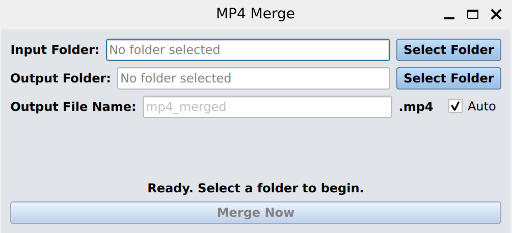

# MP4 Merge
This application merges/concatenates a folder full of MP4 files into one singular mp4 file. This app is intended to be used on a folder of videos from a dashcam, but may also be used in other applications where the videos' sources are identical. This application has versions for Windows, MacOS, and Linux.

## How to Use
Select an input folder full of MP4 files and an output folder where you would like your merged result to be saved. For the best results, select a different input folder and output folder (see below.)
If you would like to name the output file, disable the auto checkbox and enter a custom name in the input field. Note that if the output folder contains a file with the same name as the potential result
file prior to merging, the existing file will be overwritten. Finally, click the merge button and view your video!

### Limitations
Due to the nature of concatenating videos using ffmpeg, this application has significant limitations. The mp4 files in the folder *must* come from the same source (for example, all from the same video camera.)
Ffmpeg is very senstive to differing properties in video streams. Also, **videos produced by this application cannot be re-merged**. Ffmpeg does not regulate timestamps while concatenating; irregular timestamp 
metadata result videos will cause corrupted video if merged again.

## The Code
This is a wrapper for ffmpeg coded in Python and utilizing PyQt6 for the graphical user interface. Executable files were created for Windows, MacOS, and Linux using PyInstaller.

## About
This program was created by Luke, a CS major at University of Central Florida.
